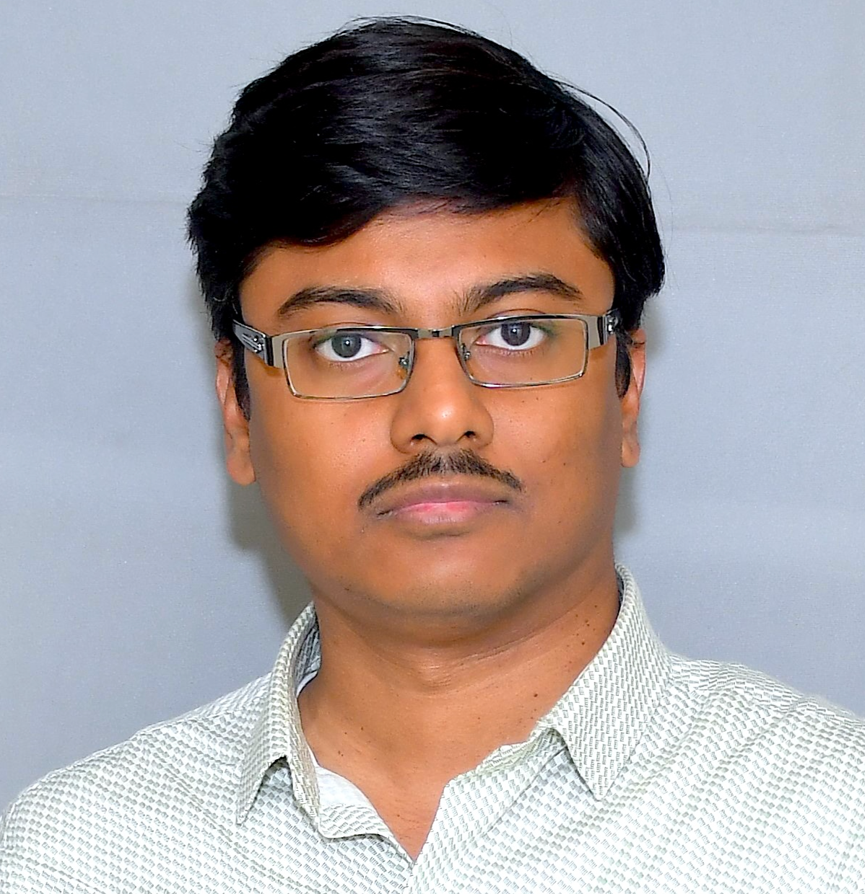
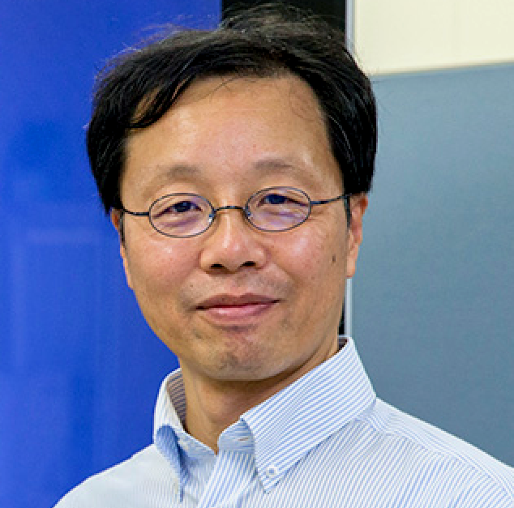

# Workshop on Visualization for Digital Humanities

 
In conjunction with:  
[IEEE Pacific Visualization Conference 2025](https://pacificvis2025.github.io/pages/index.html)  
<!--  
Tuesday, 22 April 2025   -->

### Workshop Date

Tuesday, April 22, 2025

## Workshop Theme

Digital Humanities is a research field that aims to bring new insights to the humanities through scientific techniques centered on computer science and technology. Recently, the digital data handled by Digital Humanities has become more complex and massive, now referred to as cultural big data, which is not only vast but also multimodal, combining image, audio, text, and other types of data.
To extract and utilize information from such complex and diverse big data, it is essential to integrate and further develop various visualization technologies, such as multimodal visualization, massive information visualization, time-series visualization, AI-assisted visualization, noise processing, feature extraction, see-through visualization, immersive visualization, and many others. Additionally, Digital Humanities is, by its nature, an interdisciplinary academic field that integrates the humanities and sciences, with a focus on the convergence of different disciplines.

Based on the above, this workshop aims to provide an opportunity for researchers from various fields, regardless of their background in the humanities or sciences, to gather and exchange ideas. The focus will be on discussing the latest developments in visualization and visual analysis within the context of digital humanities.

## Participation/Call for Papers

We invite original, unpublished short papers of up to 6 pages including references. Please note that 6 pages is the length limit, not the expected length. Manuscripts should be prepared according to the guide for authors given at [https://tc.computer.org/vgtc/publications/conference/](https://tc.computer.org/vgtc/publications/conference/). We are in touch with IEEE to get approval for the accepted papers to be published in the IEEE Xplore Digital Library.

## Review Process

All submissions will be peer-reviewed by field experts and evaluated based on their relevance to the workshop theme, technical rigor, creativity, originality, and the impact of the methods or results. The workshop will follow a double blind review system.

## Submission Process

To be announced soon

<!-- ## Publication

To be announced soon -->

## Timeline/Important Dates

Submission deadline: January 6, 2025 
Notification: Feb 12, 2025 
Camera ready deadline: Feb 22, 2028 

## Committees and Chairs

#### Workshop Chairs

<!--

    

      

    

    

      

    

-->

<!-- 

  
  

 -->

<!--
 -->

- Soumya Dutta, Indian Institute of Technology Kanpur (IIT Kanpur), India
- Satoshi Tanaka, Ritsumeikan University, Japan

#### Program Committee

1. Hiroaki Natsukawa, Osaka Seikei University, Japan
2. Satoshi Takatori, Ritsumeikan University, Japan
3. Liang Li, Ritsumeikan University, Japan
4. Jiao Pan, University of Science and Technology Beijing, China
5. Weite Li, Chongqing Technology and Business University, China

### Contact Us

- Soumya Dutta, Workshop Chair, soumyad at cse dot iitk dot ac dot in
- Satoshi Tanaka, Workshop Chair, stanaka at is dot ritsumei dot ac dot jp
