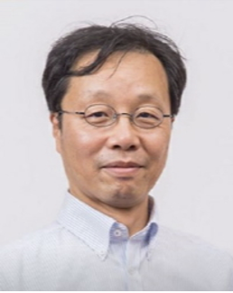

# Workshop on Visualization for the Digital and Public Humanities (DPH-Vis)

### In conjunction with [IEEE Pacific Visualization Conference 2025](https://pacificvis2025.github.io/pages/index.html)

 

 
 

## Workshop Date

Tuesday, April 22, 2025

## Workshop Theme

Digital Humanities is a research field that aims to bring new insights to the humanities through scientific methodologies centered on computer science and technology. In the current era of big data, the digital data handled by Digital Humanities has become more complex, massive, and multi-source.

In this context, a new trend in Digital Humanities has emerged, aiming to involve a broader range of people from various fields in discussions within the humanities through interdisciplinary research utilizing digital technologies. This trend is known as "Digital and Public Humanities (DPH)." In this interdisciplinary fusion, visualization should play an essential role. Therefore, we are launching a new workshop titled "Workshop on Visualization for the Digital and Public Humanities (DPH-Vis)" as part of PacificVis 2025. This workshop is not just a gathering but a platform that fosters new interdisciplinary collaboration. We welcome researchers from various fields, both in scientific and humanities areas.

Visualization for DPH involves a variety of visualizations: high-quality visualization,
feature-highlighting visualization, AI-assisted visualization, immersive visualization, visualization of digital twins, multi-source/multi-dimensional visualization, time-series visualization, story-telling visualization, and many others. We welcome research contributions to any visualization and visual analytics targeting humanities data.

## Participation/Call for Papers

We invite original, unpublished short papers of up to 6 pages including references. Please note that 6 pages is the length limit, not the expected length. Manuscripts should be prepared according to the guide for authors given at [https://tc.computer.org/vgtc/publications/conference/](https://tc.computer.org/vgtc/publications/conference/).

## Submission and Review Process

The worksho will use the [Precision Conference System (PCS)](https://new.precisionconference.com/user/login) to handle the submission and reviewing process. When submitting, at the top of the PCS Submissions tab, please select 'VGTC' for the society, 'PacificVis 2025' for the conference/journal, and 'PacificVis 2025 Workshop on Visualization for Digial and Public Humanities' for the track. All submissions will be peer-reviewed by field experts and evaluated based on their relevance to the workshop theme, technical rigor, creativity, originality, and the impact of the methods or results. The workshop will follow a double blind review system.

## Publication

We are in touch with IEEE to get approval for the accepted papers to be published in the IEEE Xplore Digital Library.

## Timeline/Important Dates

Submission deadline: January 6, 2025 
Notification: February 12, 2025 
Camera ready deadline: February 22, 2025 

 

## Keynote Speakers

### Keynote 1

### Prof. Chongke Bi, College of Intelligence and Computing, Tianjin University, China

  

    
  

### Title: Emotion-Driven Talking Face Generation for Digital Humanities

### Abstract:

Emotion-driven talking face generation is a crucial and rapidly developing technology in the field of digital humanities. For example, it can be used to reconstruct the likeness of historical figures, bringing them “to life” to help people better understand history and culture. It can even enable historical figures to engage in multilingual communication, promoting cultural exchange on an international level. Additionally, it can be applied in virtual tour guides, allowing users to customize the likeness of their favorite celebrities as guides. Emotion-driven talking face generation involves transferring facial motion attributes from audio or video onto any portrait image to generate realistic talking face videos. In the domain of representation learning, one of the key challenges for this technology is effectively disentanglement facial expressions and head poses to achieve more natural and precise control in video editing and human-computer interaction. This talk will introduce our recent work for disentanglement speaking motion representations based on prior knowledge, such as the attention disentanglement model, 3DMM model, and Facial Action Coding System (FACS). Additionally, the application of generative models like GAN and NeRF in the task of talking face synthesis will also be discussed. Finally, several digital humanities applications will also be shown.

### Speaker Bio:

Chongke Bi received his BSc (Eng.) and MSc (Eng.) degrees from Shandong University in 2004 and 2007, respectively, and his PhD (Sci.) degree from The University of Tokyo, Japan, in 2012. From 2012 to 2016, he was a Researcher at RIKEN, Japan, where he focused on the research in the field of visual analysis of large-scale simulation on supercomputer. He is currently a professor at the college of intelligence and computing, Tianjin University. His research interests include visualization, machine learning, and high performance computing. He was the Organizing Chair of the 13th and 14th IEEE Pacific Visualization Symposium (IEEE PacificVis 2020 and 2021); the Poster Chair of IEEE PacificVis 2018. He was also served as the Program Co-chair of the 17th International Symposium on Visual Information Communication and Interaction (VINCI 2024). He has been the Chair of the International Forum in ChinaVis since 2018; the Chair of CSIG-VIS International Lecture Series since 2021 (https://chinavis.org/lectures/english/index_en.html).

 

### Keynote 2

### Prof. Liang Li and Prof. Satoshi Tanaka, College of Information Science and Engineering, Ritsumeikan University, Japan

  

    
  

  

    
  

### Title: High-Visibility Edge-Highlighting Visualization of Large-Scale 3D-Scanned Point Clouds of Cultural Heritage Objects

### Abstract:

The theme of this keynote talk is the visualization of 3D scanned data; a new type of big data produced by modern 3D scanning technology. Recent advances in 3D scanning have made it easier to conduct 3D scans of large-scale cultural heritage objects. The data obtained from these scans result in large-scale point cloud datasets consisting of hundreds of millions of 3D points or even more. In this talk, we will introduce the theory and practice of our method, “dual 3D-edge extraction,” which efficiently and comprehensively extracts 3D edge information from large-scale point cloud data of cultural heritage objects, enabling high-visibility visualization of the complex 3D structures of scanned objects. Our method allows for the accurate extraction and visualization of not only sharp edges but also the soft edges (rounded edges) that are abundant in real cultural heritage objects. Furthermore, the synergy between sharp and soft edges enables halo effects that significantly enhance depth perception. We will present examples of visualizations of highly valuable cultural heritage objects, including the Borobudur Temple (Indonesia), a UNESCO World Heritage site, the festival floats of the Gion Festival (Kyoto, Japan), one of the three largest traditional festivals in Japan, and many others.

### Speaker Bio 1: Prof. Liang Li

Liang Li received his M.Eng. and Dr.Eng. degrees from Hiroshima University in 2008 and 2011, respectively. He is currently a Professor at the College of Information Science and Engineering at Ritsumeikan University, Japan, where he also serves as the Vice Director of the Ritsumeikan International IT Education Promotion Office. He is an executive board member of the Japan Society of Simulation Technology and a council member of the ASIASIM Federation. His primary research interests include visual information processing, visualization, virtual reality, and the application of these technologies in digital humanities. His work in the visualization of cultural heritage has earned numerous recognitions, including multiple Best Paper Awards at international conferences and Gold Awards in art competitions. His research has been featured by major media outlets such as NHK, Yomiuri Shimbun, and Kyoto Shimbun.

### Speaker Bio 2: Prof. Satoshi Tanaka

Prof. Satoshi Tanaka received his Ph.D. in theoretical physics from Waseda University, Japan, in 1987. After serving as an assistant professor, senior lecturer, and associate professor at both Waseda University and Fukui University, he became a professor at Ritsumeikan University in 2002. His current research focuses on the computer visualization of complex 3D shapes, such as 3D-scanned cultural heritage objects, internal structures of the human body, and fluid simulation results. He has held influential positions, including vice president of the Visualization Society of Japan (VSJ), president of the Japan Society for Simulation Technology (JSST), and president of ASIASIM (Federation of Asia Simulation Societies). Currently, he is a cooperating member of the Japan Science Council. Regarding PacificVis, he served as the local organizing chair for the first conference, PacificVis 2008 (Kyoto), and later as the poster chair for PacificVis 2014 (Yokohama). He has received best paper awards at the Asia Simulation Conferences (2012 and 2022), the Journal of Advanced Simulation in Science and Engineering in 2014, among others. His recent work on the precise visualization of 3D-scanned data of cultural heritage objects has received international acclaim, leading to numerous invitations for keynote and invited talks at international conferences, including Cyberworlds 2019 (11 in total from 2015-2023).

 

## Committee and Chairs

#### Workshop Chairs

  

    
    
Soumya Dutta

    
IIT Kanpur, India

  

  

    
    
Satoshi Tanaka

    
Ritsumeikan University, Japan

  

 

#### Program Committee

1. Hiroaki Natsukawa, Osaka Seikei University, Japan
2. Satoshi Takatori, Ritsumeikan University, Japan
3. Liang Li, Ritsumeikan University, Japan
4. Jiao Pan, University of Science and Technology Beijing, China
5. Weite Li, Chongqing Technology and Business University, China
6. Takayuki Itoh, Ochanomizu University, Tokyo, Japan
7. Naohisa Sakamoto, Kobe University, Kobe, Japan
8. Chongke Bi, College of Intelligence and Computing, Tianjin University, Tianjin, China
9. Kyoko Hasegawa, Tokai University, Tokyo, Japan
10. Susumu Nakata, Ritsumeikan University, Osaka, Japan
11. Koji Koyamada, Data science Dept., Osaka-seikei　University, Osaka, Japan
12. Woong Choi, College of ICT Construction & Welfare Convergence,  Kangnam

### Contact Us

- Soumya Dutta, Workshop Chair, soumyad at cse dot iitk dot ac dot in
- Satoshi Tanaka, Workshop Chair, stanaka at is dot ritsumei dot ac dot jp
